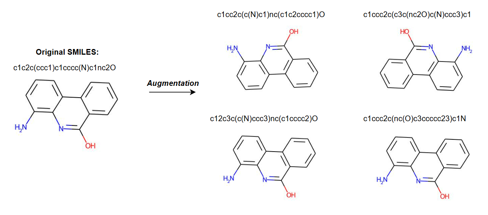
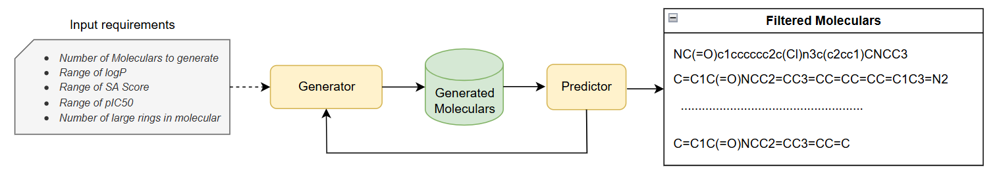
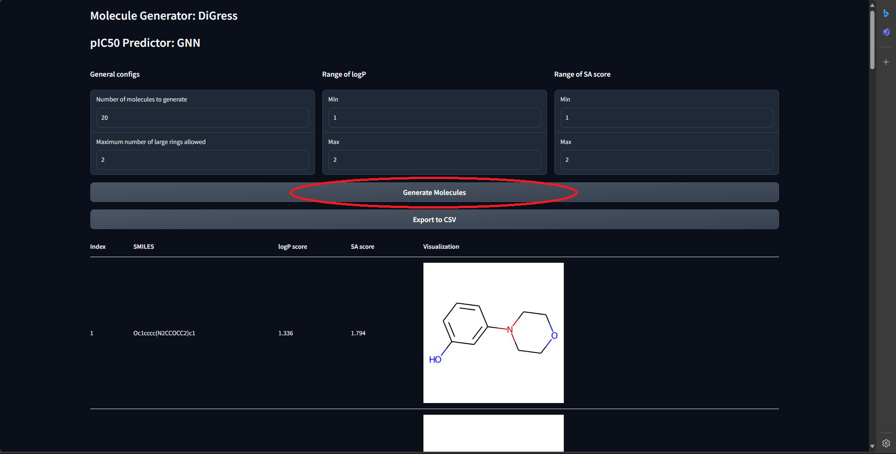

# Molecule Generation with DiGress

Pytorch implementation for "Integrating Diffusion Models and Molecular Modeling for PARP1 Inhibitors Generation". This repository combines DiGress diffusion model for molecule generation with a GNN-based predictor for pIC50 value estimation.

## Environment Setup

This code was tested with PyTorch 2.0.1, CUDA 11.8 and torch_geometrics 2.3.1

### 1. Create a conda environment with RDKit

```bash
# Download anaconda/miniconda if needed

# Create a rdkit environment that directly contains rdkit
conda create -c conda-forge -n digress rdkit=2023.03.2 python=3.9

# Activate the environment
conda activate digress

# Check that RDKit is installed correctly
python -c 'from rdkit import Chem'
```

### 2. Install graph-tool

```bash
# Install graph-tool
conda install -c conda-forge graph-tool=2.45

# Check that graph-tool is installed correctly
python -c 'import graph_tool as gt'
```

### 3. Install CUDA and PyTorch

```bash
# Install the nvcc drivers for your cuda version
conda install -c "nvidia/label/cuda-11.8.0" cuda

# Install a compatible version of PyTorch
pip install torch==2.0.1 --index-url https://download.pytorch.org/whl/cu118
```

### 4. Install other dependencies

```bash
# Install remaining packages
pip install -r requirements.txt
```

## Training Models

### Data and Weights Setup

Data and trained weights can be downloaded here: https://drive.google.com/drive/folders/1WgtLS8pAy-bgU_L9s94MvZg1IwTbiIrr?usp=sharing

After downloading the data and weights files, extract them and organize the directories:

```bash
unzip data.zip
unzip weights.zip
```

Make sure the `./data/` directory contains the `generator` and `predictor` folders with the necessary training data and pre-trained weights.

### Training the Generators

#### DiGress Generator

```bash
# Ensure you're in the project root directory
# Train the DiGress generator
python generator.py --model digress --task train --n_epochs 100 --batch_size 1024
```

Configuration for DiGress training can be modified in `configs/digress/train/train_default.yaml`.

#### MOOD Generator

```bash
# Train the MOOD generator
python generator.py --model mood --task train --n_epochs 100 --batch_size 1024
```

Configuration for MOOD training can be modified in `configs/mood/prop_train.yaml`.

#### GDSS Generator

```bash
# Train the GDSS generator
python generator.py --model gdss --task train --n_epochs 100 --batch_size 1024
```

Configuration for GDSS training can be modified in `configs/gdss/zinc250k.yaml`.

#### Molecular VAE Generator

```bash
# Train the Molecular VAE generator
python generator.py --model vae --task train --n_epochs 100 --batch_size 1024
```

Configuration for VAE training can be modified in `configs/vae/vae.yaml`.

### Training the GNN Predictor

The GNN predictor is pre-trained on pIC50 data. If you need to retrain it:

```bash
# Train the GNN predictor
cd predictors/molecularGNN_smiles/main/
python train.py --config ../../configs/gnn/gnn.yaml
```

#### SMILES Data Augmentation



To improve model robustness, the GNN predictor uses SMILES data augmentation during training. This process generates multiple SMILES representations of the same molecule, effectively increasing the training dataset size. The augmentation script is in data/augment_smiles.py

## Inference

### Direct Molecule Generation (Generator Only)

You can directly generate molecules using any generator without filtering:

#### DiGress Generator

```bash
# Generate molecules using DiGress
python generator.py --model digress --task generate --n_samples_to_generate 100
```

#### MOOD Generator

```bash
# Generate molecules using MOOD
python generator.py --model mood --task generate --n_samples_to_generate 100
```

#### GDSS Generator

```bash
# Generate molecules using GDSS
python generator.py --model gdss --task generate --n_samples_to_generate 100
```

#### Molecular VAE Generator

```bash
# Generate molecules using Molecular VAE
python generator.py --model vae --task generate --n_samples_to_generate 100
```

These commands will generate the specified number of SMILES strings directly from the corresponding generator without any filtering. The results will be saved to a text file named `generated_smiles_{model}.txt`.

### Complete Pipeline (Generation + Filtering)

## Pipeline Overview



**Pipeline Summary**: The complete molecule generation and filtering pipeline consists of several main stages: **Molecule Generation** using the best generator DiGress, **Property Prediction** where generated molecules are evaluated using a GNN-based predictor for pIC50 values along with calculation of other molecular properties like logP, SA scores and number of large rings, **Filtering** where molecules are screened based on specified property thresholds and structural constraints, and **Output** of the final set of optimized molecules that meet all criteria for potential PARP1 inhibitor activity.

To run the complete pipeline (generation, property prediction, and filtering):

```bash
# Complete pipeline with DiGress generator
python run.py --model digress --n_final_smiles 20
```

This pipeline will:
1. Generate a larger batch of molecules using the specified generator
2. Calculate properties (logP, SA, pIC50) for each molecule
3. Filter molecules based on property thresholds
4. Return the requested number of filtered molecules

### Using the Gradio Demo Interface

For a user-friendly interface that runs the complete pipeline:

```bash
# Launch the Gradio interface
python gradio_demo.py
```



The interface allows you to:
1. Specify the number of molecules to generate
2. Set property ranges (logP, SA, pIC50, number of large rings)
3. Start generating molecules and visualization by clicking "Generate Molecules"
4. Export results to CSV by clicking "Export to CSV"

## Project Structure

- `run.py`: Complete pipeline script (generation + filtering)
- `gradio_demo.py`: Web interface for molecule generation
- `generator.py`: Contains implementations of molecule generators
- `filterer.py`: Handles SMILES filtering based on molecular properties
- `predictor.py`: Contains GNN-based pIC50 predictor
- `configs/`: Configuration files for generators and predictors
- `generators/`: Contains different molecule generation models
  - `DiGress/`: Implementation of DiGress diffusion model
  - `MOOD/`: Implementation of MOOD generator
  - `GDSS/`: Implementation of GDSS generator
  - `Molecular-VAE/`: Implementation of Molecular VAE generator
- `predictors/`: Contains different property prediction models
  - `molecularGNN_smiles/`: GNN-based pIC50 predictor

## Citation

If you use this code, please cite our paper:

```
@article{
  title={Integrating Diffusion Models and Molecular Modeling for PARP1 Inhibitors Generation},
  author={},
  journal={},
  year={}
}
```

## License

[MIT License](LICENSE) 
